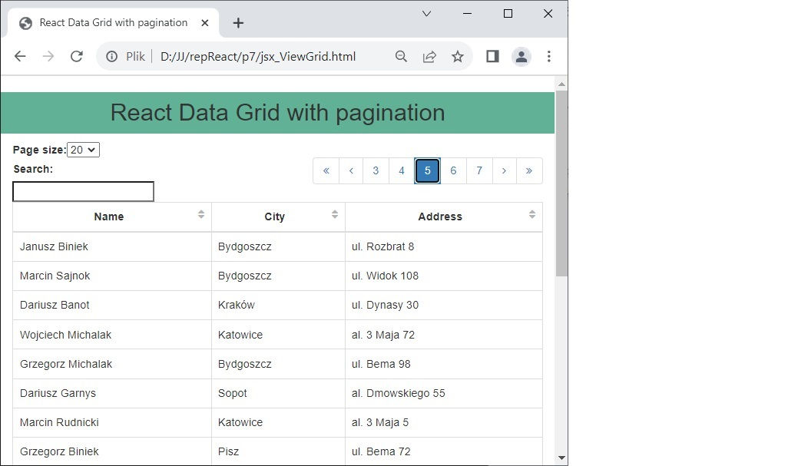

# React DataGrid with pagination

This page demonstrates using external React component - ReactDataComponents.DataTable: an advanced table 
      for presenting tabular data with columns and rows, such as SQL query results.
      The component has advanced data display options such as: column configuration, 
      row pagination, sorting etc. 
      This webpage using React with no build tooling, no use NPM.

- React without NPM;
- Project in one .html file;
- Used external React component: ReactDataComponents.DataTable with JSX syntax;
- Adding React elements to a regular html webpage;

.

## Details

- React ver.15 sources are linked online from the internet;
- The Babel ver.5.8 compiler for JSX syntax is linked online from the Internet;
- Project written in Visual Studio Code;
